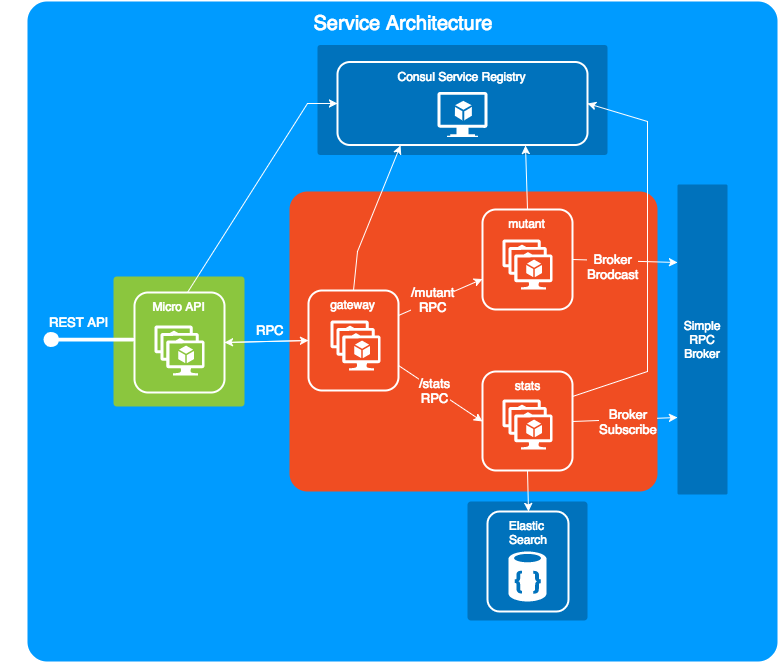
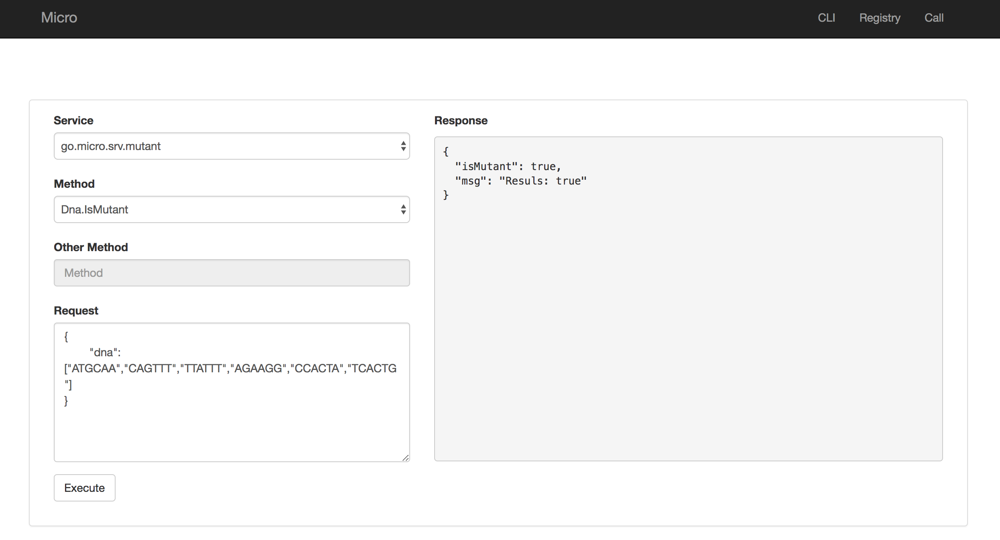
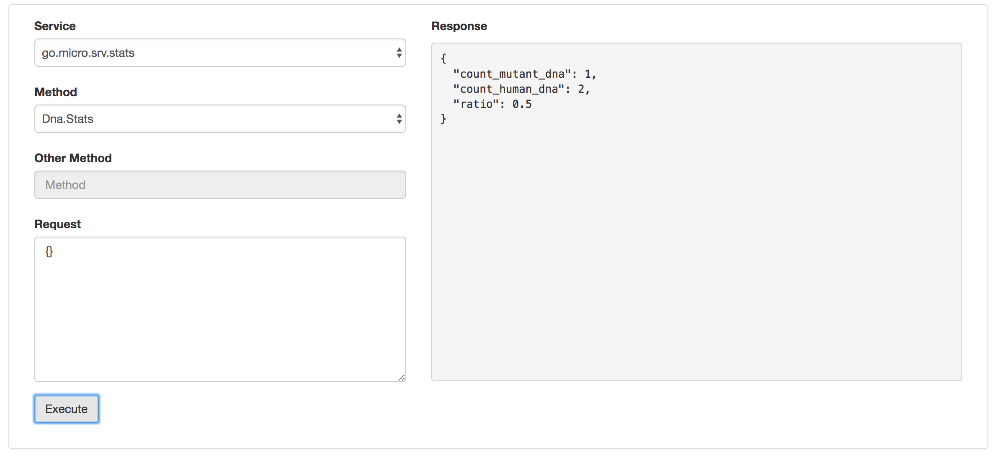

# Mutant solution with Go-Micro   

This repo contains an examples solution for serving microservices via the micro api. We use the following technologies:

## [Go Micro](https://micro.mu/docs/)
Go Micro is a pluggable RPC framework for distributed systems development.

The micro philosophy is sane defaults with a pluggable architecture. It provides defaults to get you started quickly but everything can be easily swapped out. It comes with built in support for {json,proto}-rpc encoding, consul or multicast dns for service discovery, http for communication and random hashed client side load balancing.

## [Consul](https://www.consul.io/intro/index.html)

Consul is a service mesh solution providing a full featured control plane with service discovery, configuration, and segmentation functionality. Each of these features can be used individually as needed, or they can be used together to build a full service mesh. Consul requires a data plane and supports both a proxy and native integration model. Consul ships with a simple built-in proxy so that everything works out of the box, but also supports 3rd party proxy integrations such as Envoy.

## [Micro API](https://github.com/micro/micro/tree/master/api)
The micro api is an API gateway which serves HTTP and routes to RPC based services. 
In the micro ecosystem we logically separate concerns via architecture and tooling. Read more on buiding an API layer of services 
in the [architecture blog post](https://micro.mu/blog/2016/04/18/micro-architecture.html).

## [ElasticSearch](https://www.elastic.co/products/elasticsearch)

Elasticsearch is a distributed, RESTful search and analytics engine capable of solving a growing number of use cases. As the heart of the Elastic Stack, it centrally stores your data so you can discover the expected and uncover the unexpected.

# Project Overview
The technologies used are the followings:
* [GoLang](http://www.golang.org/): Go is an open source programming language that makes it easy to build simple, reliable, and efficient software.
* [Go Dep](https://github.com/golang/dep): Golang dependency manager.
* [Protobuf](https://github.com/golang/protobuf): This is protobuf code generation for micro, to use Google's data interchange format.

Project code structure:

    doc/            Some documentation resources

    srv/            ml-mutant micreoservices
      gateway
      mutant
      stats
    
    deploy/          Deployment instruction and resources

    verndor/         Dependency folder created by dep

# Getting Started

Let's start setting up our workspace doing the following:

* [Install GoLang](https://golang.org/doc/install)
* [Install Dep](https://github.com/golang/dep#installation)
* [Install Protobuf](https://github.com/micro/protoc-gen-micro#install)
* [Install docker](https://docs.docker.com/install/)

Then get the repository using go get:

    go get github.com/rodrigodmd/ml-mutant-srv

Resolve Dependencies with dep:

    cd $GOPATH/src/github.com/rodrigodmd/ml-mutant-srv
    dep ensure

To run all the services locally we can use docker compose.

    docker-compose up

Local endpoints:

    http://localhost:8080/api/mutant
    http://localhost:8080/api/stats

You can also play with the go micro development web: http://localhost:8082

Congratulations! Now you are ready to work in each micro service:

* gateway
* mutant
* stats

### Build and push base docker image:

    make docker-push

## Deploymeny

Go to [deploy section](./deploy).
