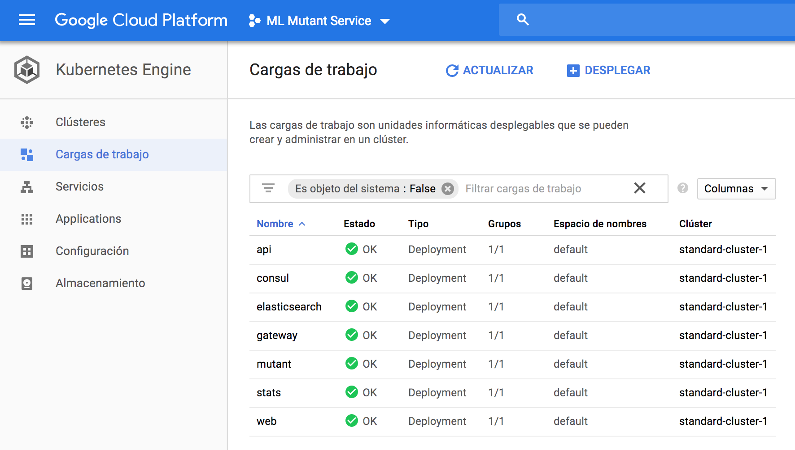
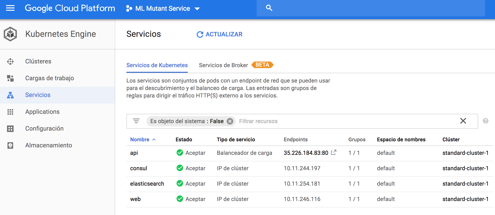

# Deployment scripts

The deploymeny uses the pushed docker images:
https://hub.docker.com/r/rodrigodmd/ml-mutant-srv/tags/

To deploy in kubernates run:

    ./deploy-kubernetes.sh

(NOT TESTED) To deploy in openshift run:

    ./deploy-openshift.sh

